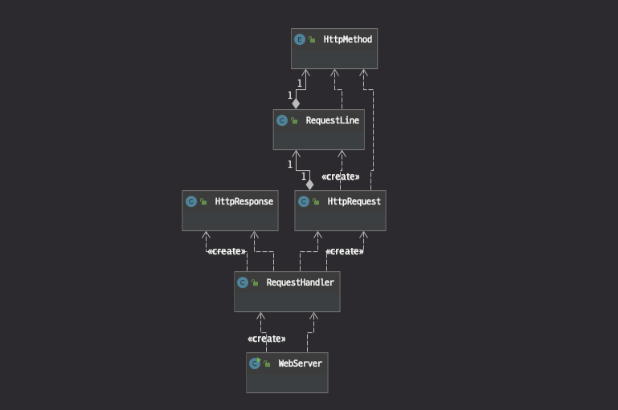

# 5.1 HTTP 웹 서버 리팩토링 실습

환경 셋팅

- Maven 프로젝트로 설정
- [Project 환경] Properties > Resource > Text file encoding : `UTF-8` 로 설정
- [Intellij 전역 환경] 환경설정(`cmd + ,`) > General > Workspace > Text file encoding > Default 가 원하는 인코딩 설정이 아니면, Other 로 설정해주면 됨

## 5.1.1 리팩토링할 부분 찾기

[리팩토링: 코드 품질을 개선하는 객체지향 사고법](https://www.notion.so/e95877feb5d74870a25a2ad241c2c5f7)

책에서는 리팩토링이 필요한 시점에 대한 정확한 기준을 제시하기보다 경험적으로 인간의 직관에 맡기고 있다. 리팩토링을 할 때 어떤 기준을 가지고 하기 보다는 직관에 의존해 진행한다.

이런 직관을 키우려면 좋은 코드, 나쁜 코드를 가리지 말고 다른 개발자가 구현한 많은 코드를 읽을 필요가 있다.

다음 단계는 소스코드를 직접 구현해 보는 것이다. (많은 코드를 구현한다고 해서 리팩토링 실력이 늘지 않는다.)

자신이 구현한 코드에 대해 지속적으로 의도적인 리팩토링을 할 때 한 단계 성장할 수 있다.

2장 문자열 계산기를 더 이상 리팩토링할 부분이 없다고 판단될 때까지 극단적으로 연습해 보는 것도 좋은 습관이다.


RequestHandler 클래스의 책임을 분리한다. • RequestHandler 클래스는 많은 책임을 가지고 있다. 객체 지향 설계 원칙 중 “단일 책임의 원칙”에 따라RequestHandler 클래스가 가지고 있는 책임을 찾아 각 책임을 새로운 클래스를 만들어 분리한다.

------

- 힌트
  - 클라이언트 요청 데이터를 담고 있는 InputStream을 생성자로 받아 HTTP 메소드, URL, 헤더, 본문을 분리하는 작업을 한다.
  - 헤더는 Map<String, String>에 저장해 관리하고 getHeader("필드 이름") 메소드를 통해 접근 가능하도록 구현한다.
  - GET과 POST 메소드에 따라 전달되는 인자를 Map<String, String>에 저장해 관리하고 getParameter("인자 이름") 메소드를 통해 접근 가능하도록 구현한다.
  - RequestHandler가 새로 추가한 HttpRequest를 사용하도록 리팩토링한다.

# 테스트 코드 구현

위 요구사항을 구현하기 위해 새로운 클래스를 만들어 구현할 때 테스트 코드 기반으로 개발할 수 있다. `src/test/resources` 디렉토리에 `Http_GET.txt` 라는 이름으로 요청 데이터를 담고 있는 테스트 파일을 추가한다.

※ `Http_GET.txt` 파일의 마지막 라인에 빈 공백 문자열을 포함해야 한다.

이 파일을 이용한 테스트 코드 작성

- Http_GET.txt

```
GET /user/create?userId=solar&password=1234&name=Sunyoung HTTP/1.1
Host: localhost:8080
Connection: keep-alive
Accept: */*
```

- Http_POST.txt

```
GET /user/create HTTP/1.1
Host: localhost:8080
Connection: keep-alive
Content-Length: 46
Content-Type: application/x-www-form-urlencoded
Accept: */*

userId=solar&password=1234&name=Sunyoung
```

- 테스트 코드

```java
public class HttpRequestTest {
    private String testDirectory = "./src/test/resources/";

    @Test
    public void request_GET() throws FileNotFoundException {
        InputStream in = new FileInputStream(new File(testDirectory + "Http_GET.txt"));
        HttpRequest request = new HttpRequest(in);

        assertEquals("GET", request.getMethod());
        assertEquals("/user/create", request.getPath());
        assertEquals("keep-alive", request.getHeader("Connection"));
        assertEquals("solar", request.getParameter("userId"));
    }

		@Test
		public void request_POST() throws FileNotFoundException {
		    InputStream in = new FileInputStream(new File(testDirectory + "Http_POST.txt"));
		    HttpRequest request = new HttpRequest(in);
		
		    assertEquals("POST", request.getMethod());
		    assertEquals("/user/create", request.getPath());
		    assertEquals("keep-alive", request.getHeader("Connection"));
		    assertEquals("solar", request.getParameter("userId"));
		}
}
```

테스트를 위한 HTTP 요청 데이터를 텍스트 파일에 생성 한 후, FileInputStream으로 읽은 후 이 InputStream을 새로 생성한 HttpRequest 클래스의 생성자로 전달하는 방식으로 테스트할 수 있다.

위에 작성한 테스트 코드를 만족하는 HttpRequest 코드를 구현하면 된다.

테스트 데이터를 위해 파이릉ㄹ 만들고 InputStream을 생성하는 과정이 번거롭게 느껴지면 String으로 문자열을 전달해 테스트할 수 있는 방법을 고민해보자


---

# 5.2.1 요청데이터를 처리하는 로직을 별도의 클리스로 분리

리팩토링 전 RequestHandler 클래스가 담당하는 작업

- 클라이언트 요청에 대한 헤더와 본문 데이터 처리
- 클라이언트 요청에 따른 로직 처리(회원가입, 로그인 등)
- 로직 처리 완료 후, 클라이언트에 대한 응답 헤더와 본문 데이터 처리 작업

클래스 하나가 너무 많은 일을 하고 있다.

각 객체가 한 가지 책임을 가지도록 설계를 개선하는 리팩토링을 진행

1. RequestHandler 클래스가 가지고 있는 책임 중, 클라이언트 요청 데이터와 응답 데이터 처리르 별도의 클래스로 분리

**HttpRequest의 책임**

클라이언트 요청 데이터를 읽은 후 각 데이터를 사용하기 좋은 형태로 분리하는 역할만 담당 (데이터 파싱)

분리한 데이터를 사용하는 부분은 RequestHandler가 가지도록 한다. (데이터 사용)

**테스트 코드를 기반으로 개발할 경우 얻을 수 있는 효과**

- 클래스에 버그가 있는지 빨리 찾아 구현 가능

  RequestHandler가 바로 사용하기 전에 HttpRequest 기능이 정상적으로 동작하는지 테스트를 마친 후 사용하면 수동 테스트 횟수가 많이 줄어든다.

- 디버깅하기 쉽다.

  클래스에 대한 단위 테스트를 하여 어느 클래스에서 발생한 버그인지 좀 더 쉽고 빠르게 해결할 수 있기 때문에 개발 생산성을 높여준다.

- 테스트 코드가 있기 때문에 리팩토링하기 편하다.

  테스트코드가 없다면 리팩토링 시 프로덕션 코드를 수정하는 시간 보다 리팩토링한 코드가 정상적으로 동작하는지 검증하기위한 테스트에 더 많은 시간이 소요된다.

계속해서 리팩토링할 부분이 없는지 소스코드를 다양한 시각으로 찾아봐야 한 단계 성장할 수 있다.

------

## 1차 리팩토링

```java
import static util.HttpRequestUtils.parseHeader;

public class HttpRequest {
    private static final Logger log = LoggerFactory.getLogger(HttpRequest.class);

    private String method;
    private String path;
    private Map<String, String> headers = new HashMap<>();
    private Map<String, String> params = new HashMap<>();

    public String getMethod() {
        return method;
    }

    public String getPath() {
        return path;
    }

    public String getHeader(String key) {
        return headers.get(key);
    }

    public String getParameter(String key) {
        return params.get(key);
    }

    public HttpRequest(InputStream in) {
        try {
            BufferedReader br = new BufferedReader(new InputStreamReader(in, "UTF-8"));
            String line = br.readLine();
            if (line == null) {
                return;
            }

            processRequestLine(line);

            this.headers.put("Content-Length", "0");
            line = br.readLine();
            while (line != null && !line.equals("")) { //헤더 //line.equals("")만 있을 때, GET 메세지에서 NPE가 발생해서 조건 추가
                log.debug("header : {}", line);
                HttpRequestUtils.Pair header = parseHeader(line);
                if (header != null) {
                    headers.put(header.getKey(), header.getValue());
                }
                line = br.readLine();
            }

            if (this.method.equals("POST")) {
                String body = IOUtils.readData(br, Integer.parseInt(headers.get("Content-Length")));
                this.params = HttpRequestUtils.parseQueryString(body);
            }
        } catch (IOException e) {
            e.printStackTrace();
        }

    }

    private void processRequestLine(String requestLine) {
        log.debug("request line : {}", requestLine);
        String[] tokens = requestLine.split(" ");
        method = tokens[0];

        if ("POST".equals(method)) {
            path = parseDefaultUrl(tokens);
            return;
        }

        int index = parseDefaultUrl(tokens).indexOf("?"); //GET에 queryString 존재 여부에 따라 로직 분리
        if (index == -1) {
            this.path = parseDefaultUrl(tokens);
            return;
        }

        path = parseDefaultUrl(tokens).substring(0, index);
        params = HttpRequestUtils.parseQueryString(parseDefaultUrl(tokens).substring(index + 1));
    }

    private String parseDefaultUrl(String[] tokens) {
        String url = tokens[1];
        if (url.equals("/")) {
            url = "/index.html";
        }
        return url;
    }
}
```

------

## 2차 리팩토링

※ **리팩토링 해야할 부분 찾기**

1. HttpRequest의 요청 라인을 처리하는 processRequestLine() 메소드의 복잡도가 높다.

애플리케이션을 개발하다 보면 private 메소드인데 로직의 복잡도가 높아 추가적인 테스트가 필요하다고 생각하는 메소드가 발생한다. 하지만 현재 구조는 이 메소드만 별도로 분리해 테스트하기 힘들다.

이 메소드를 테스트 가능하도록 하려면 어떻게 해야 할까?

★ **일반적으로 해결할 수 있는 방법 두가지**

1. private 접근 제어자인 메소드를 default로 수정하고 메소드 처리 결과를 반환하도록 수정해서 테스트
2. 메소드 구현 로직을 새로운 클래스로 분리

processRequestLine() 메소드의 경우, 첫째 방법을 적용하기에는 메소드 처리 후 반환해야 하는 상태값이 한 개가 아니라 쉽지 않다. 따라서 지금 경우 `RequestLine`이라는 이름으로 새로운 클래스를 추가하는 방식으로 리팩토링을 진행해보자

```java
public class RequestLine {
    private static final Logger log = LoggerFactory.getLogger(RequestLine.class);

    private String method;
    private String path;
    private Map<String, String> params = new HashMap<>();

    public RequestLine(String requestLine) {
        log.debug("request line : {}", requestLine);
        String[] tokens = requestLine.split(" ");
        if (tokens.length != 3) {
            throw new IllegalArgumentException(requestLine + "이 형식에 맞지 않습니다.");
        }
        method = tokens[0];
        if ("POST".equals(method)) {
            path = parseDefaultUrl(tokens);
            return;
        }

        int index = parseDefaultUrl(tokens).indexOf("?");
        if (index == -1) { //GET에 queryString이 있는 경우
            path = parseDefaultUrl(tokens);
            return;
        }

        //GET에 queryString이 없는 경우
        path = parseDefaultUrl(tokens).substring(0, index);
        params = HttpRequestUtils.parseQueryString(parseDefaultUrl(tokens).substring(index + 1));
    }

    private String parseDefaultUrl(String[] tokens) {
        String url = tokens[1];
        if (url.equals("/")) {
            url = "/index.html";
        }
        return url;
    }

    public String getMethod() {
        return method;
    }

    public String getPath() {
        return path;
    }

    public Map<String, String> getParams() {
        return params;
    }
}
```

- 리팩토링 코드

[[Refactor\]: Chapter05 5.2 복잡한 메소드 구현 로직을 새로운 클래스로 분리 · blossun/web-application-server@8b45d74](https://github.com/blossun/web-application-server/commit/8b45d748ae6a4c4efcee757201bf5937fc32729c)

RequestLine이라는 새로운 클래스를 추가해 HttpRequest에서 요청 라인을 처리하는 책임을 분리했지만 **HttpRequest의 메소드 원형은 바뀌지 않았다.** 따라서 **기존의 HttpRequestTest도 변경없이 테스트할 수 있다.**

위와 같이 메소드가 private이고 메소드 처리 후 반환되는 값이 여러 개라고 반드시 새로운 객체를 추가하는 것이 정답은 아니다. 단지 **private 메소드의 복잡도가 높아 별도의 테스트가 필요한데 테스트하기 힘들다면 어딘가 리팩토링할 부분이 있겠다**는 힘트를 얻는 용도로만 활용하면 좋다.

------

## 3차 리팩토링

※ **리팩토링 해야할 부분 찾기**

- GET, POST 문자열이 하드코딩되어 사용되는 부분

**상수 값이 서로 연관되어 있는 경우 자바의 enum을 쓰기 적합한 곳이다.**

독립적으로 존재하는 상수 값은 굳이 enum으로 추가할 필요는 없지만, 남자(M)/여자(F) 또는 북쪽(NORTH)/남쪽(SOUTH)/서쪽(WEST)/동쪽(EAST)와 같이 상수 값이 연관성을 가지는 경우 enum을 사용하기 적합

1. GET, POST를 HttpMethod라는 이름의 enum으로 추가하는 리팩토링을 진행

- 리팩토링 코드

[[Refactor\]: Chapter05 5.2 GET, POST를 HttpMethod라는 이름의 enum으로 추가 · blossun/web-application-server@2196cd7](https://github.com/blossun/web-application-server/commit/2196cd7d243781074e00335d8302432ae05355cd)

1. 새로 생성한 객체가 일을 하도록 수정

**일단 새로운 객체를 추가했으면 객체를 최대한 활용하기 위해 노력해 본다.**

※ 객체를 최대한 활용하는 연습 첫번째

객체에서 값을 꺼낸 후 로직을 구현하려고 하지말고, **값을 가지고 있는 객체에 메시지를 보내 일을 시키도록 연습해보자**

HttpMethod가 POST인지 확인하는 로직을 HttpMethod 클래스에서 현재 자신의 상태가 POST인지 여부를 판단하는 `isPost()` 메소드를 추가한 후 리팩토링

```java
if (getMethod() == HttpMethod.POST)
=> 
if (getMethod().isPost())
public enum HttpMethod {
    GET,
    POST;
    
    public boolean isPost() {
        return this == POST;
    }
}
```

POST 메소드인지 여부를 판단하기 위해 HttpMethod에서 GET, POST 값을 꺼내 비교하는 것이 아니라 이 값을 가지고 있는 HttpMethod가 POST 여부를 판단하도록 메시지를 보내 물어본다.

클라이언트 요청 데이터에 대한 처리를 모두 HttpRequest로 위임했기 때문에 RequestHandler는 요청 데이터를 처리하는 모든 로직을 제거할 수 있다. ReqeustHandler는 HttpRequest가 제공하는 메소드를 이용해 필요한 데이터를 사용하기만 하면 된다. 이와 같이 **클라이언트 요청을 HttpRequest라는 객체로 추상화해 구현함으로써 RequestHandler는 요청 데이터를 조작하는 부분을 제거할 수 있었다.**

- 리팩토링 코드

[[Refactor\]: Chapter05 5.2 새로 생성한 HttpMethod가 일을 하도록 한다. · blossun/web-application-server@f68ec06](https://github.com/blossun/web-application-server/commit/f68ec065953c3868d546ae7de3c5b17bb5dffd51)

------

## 4차 리팩토링

RequestHandler의 isLogin() 메소드에서 HttpRequest에 쿠키 헤더 값을 꺼내 조작하는 부분

HttpRequest가 쿠키 헤더 값에 대한 처리를 담당하도록 위임하는 것이 객체지향 개발 관점에서도 좋다.

HttpRequest가 쿠키값을 처리하도록 리팩토링

- 리팩토링 코드

[[Refactor\]: Chapter05 5.2 HttpRequest가 쿠키값을 처리하도록 · blossun/web-application-server@39680b1](https://github.com/blossun/web-application-server/commit/39680b193fb145d11367835f9b795a8917289395)

------

**객체지향 설계에서 중요한 연습은 요구사항을 분석해 객체로 추상화하는 부분이다.**

요구사항이 명확한 애플리케이션(체스 게임, 지뢰 찾기)으로 연습할 것을 추천


---

# 5.2.2 응답데이터를 처리하는 로직을 별도의 클리스로 분리

- 힌트
  - RequestHandler 클래스를 보면 응답 데이터 처리를 위한 많은 중복이 있다. 이 중복을 제거해 본다.
  - 응답 헤더 정보를 Map<String, String>으로 관리한다.
  - 응답을 보낼 때 HTML, CSS, 자바스크립트 파일을 직접 읽어 응답으로 보내는 메소드는 `forward()`, 다른 URL로 리다이렉트하는 메소드는 `sendRedirect()` 메소드로 나누어 구현한다.
  - RequestHandler가 새로 추가한 HttpResponse를 사용하도록 리팩토링한다.

------

## 착각한 내용

css 파일 적용을 위해 Response Header의 Content-Type을 "text/css"로 지정해줬어야 했다.

그 과정에서 다른 `js`, `ico` 파일 요청에 대한 Response Header의 Content-Type을 해당 파일 타입으로 넘겼었다.

`Content-Type: text/js;charset=utf-8` 이렇게 보내면 파일 양식이 깨진다.

그래서 css 파일에 대한 것만 `text/css` 로 넘기고 나머지 파일들은 기본적으로 `text/html` 로 넘겼다.

```java
    public void forward(String url) throws IOException {
        byte[] body = Files.readAllBytes(new File("./webapp" + url).toPath());
        // 1. Request에서 요청한 Content-Type 값을 가지고 결정
//        String contentType = request.getHeader("Content-Type");
//        contentType = contentType.substring(contentType.indexOf("text/" + 5), contentType.indexOf(";"));
        // 2. 넘겨받은 url의 확장자를 통해서 contentType 결정
//        String contentType = url.substring(url.indexOf(".") + 1);
        String contentType = "html";
        if (url.endsWith("css")) {
            contentType = "css";
        }
        log.debug("contentType : {}", contentType);
        response200Header(contentType, body.length);
        responseBody(body);
    }
```

⇒ `MIME types` 를 맞춰서 넘겨줘야 한다.

js, css, html 등은 url에서 추출한 타입에 맞게 response header에 content-type이 잘 들어가지만, 그 외 파일들은 잘 못 적용되기 때문에 `String contentType = url.substring(url.indexOf(".") + 1);` 코드로 바로 contentType을 넘기면 안 된다.

기본적으로 `Content-Type: text/html` 로 넘기면 깨지지 않는다.


## Http의 Content-Type과 MIME types

**문법**

```
Content-Type: text/html; charset=utf-8
Content-Type: multipart/form-data; boundary=something
```

**디렉티브**

**`media-type` :** 리소스 혹은 데이터의 [MIME type](https://developer.mozilla.org/en-US/docs/Web/HTTP/Basics_of_HTTP/MIME_types).

**charset :** 문자 인코딩 표준

**boundary :** 멀티파트 개체에 대해 `boundary` 디렉티브는 필수인데, 이메일 게이트를 통해 매우 탄탄해졌다고 알려진 캐릭터셋의 1~70개의 문자들로 구성되며, 빈 공백으로 끝나지 않습니다. 이는 메시지의 멀티 파트 경계선을 캡슐화하기 위해 사용됩니다.

**MIME 타입 구조**

```html
type/subtype
```

- application/octet-stream

  바이너리 파일

- text/plain

- text/css

- text/html

- text/javascript

[Content-Type](https://developer.mozilla.org/ko/docs/Web/HTTP/Headers/Content-Type)

[MIME types (IANA media types)](https://developer.mozilla.org/en-US/docs/Web/HTTP/Basics_of_HTTP/MIME_types)

### Java HashMap foreach 문

- 람다

```java
header.forEach((k, v) -> {
                    dos.writeBytes(k + ": " + v + "\\r\\n");
            });
```

- ForEach 반복문

```java
for (Map.Entry<String, String> entry : header.entrySet()) {
    String k = entry.getKey();
    String v = entry.getValue();
    dos.writeBytes(k + ": " + v + "\\r\\n");
}
Set<String> keys = headers.keySet();
for (String key : keys) {
    dos.writeBytes(key + ": " + headers.get(key) + " \\r\\n");
}
```

### 고민했던 부분

- 헤더에 값을 저장하는 코드를 어느 메소드에서 진행해야할지 고민 forward() 또는 response200Header() 아니면 RequestHandler

- login 성공 시, Cookie 헤더 값에 값을 셋팅해줘야한다.!!

  `"Set-Cookie: logined=true`

- 따라서 Response Header는 RequestHandler에서 값을 셋팅해주고 response할 때 넘겨주는 것으로 하는 것이 좋을 듯!!!

- 리팩토링 후 클래스 다이어그램



- 리팩토링 코드

[[Chapter 05\] 웹 서버 리팩토링 - 02 HttpResponse · Issue #2 · blossun/web-application-server](https://github.com/blossun/web-application-server/issues/2)

## 테스트 코드

HttpResponseTest 코드는 HttpResponse를 통해 생성된 응답 데이터를 src/test/resources 에 파일을 생성해 수동으로 확인하도록 구현하고 있다. 수동으로 확인하는 번거로움이 있기는 하지만 HttpResponse를 다른 클래스에서 사용하기 전에 정상적으로 동작하는지 검증할 수 있다.

수동 테스트를 개선하고 싶다면 `assertEquals()` 를 통해 자동화하도록 하자


