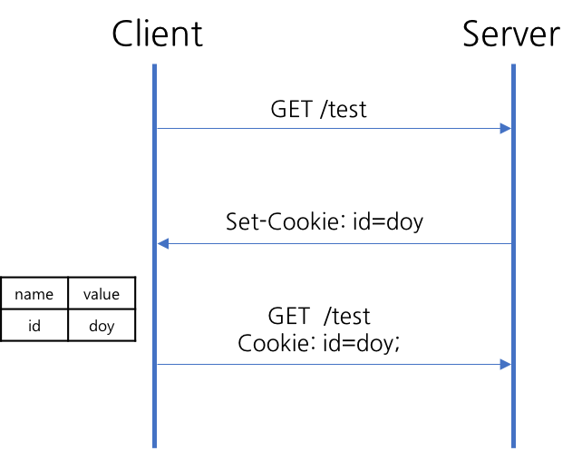
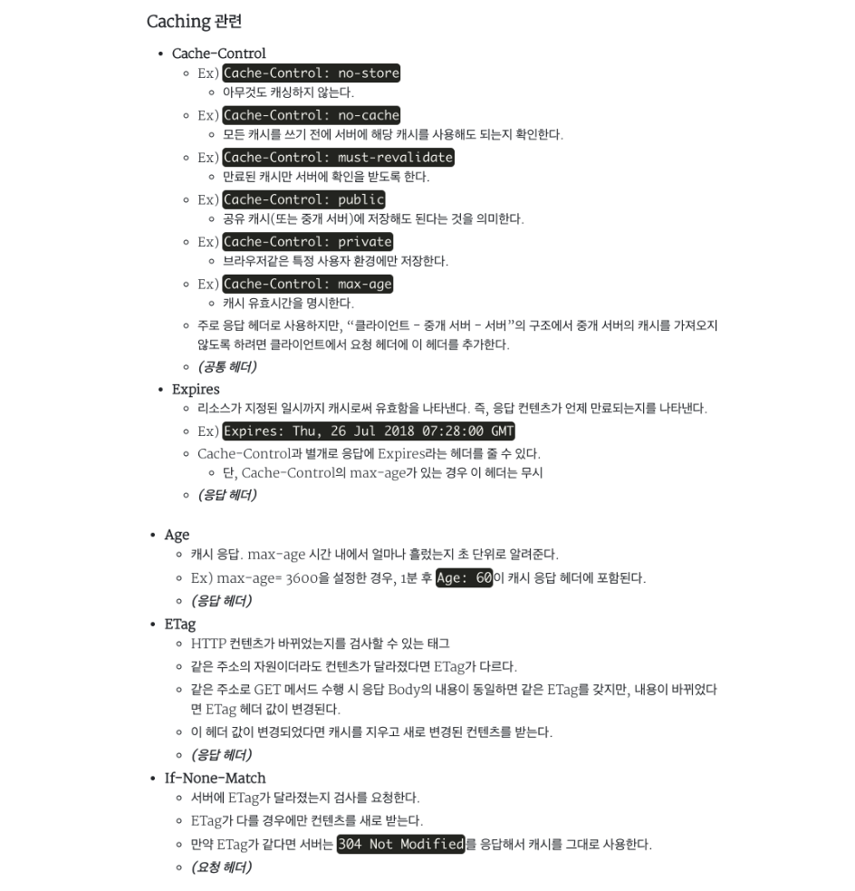
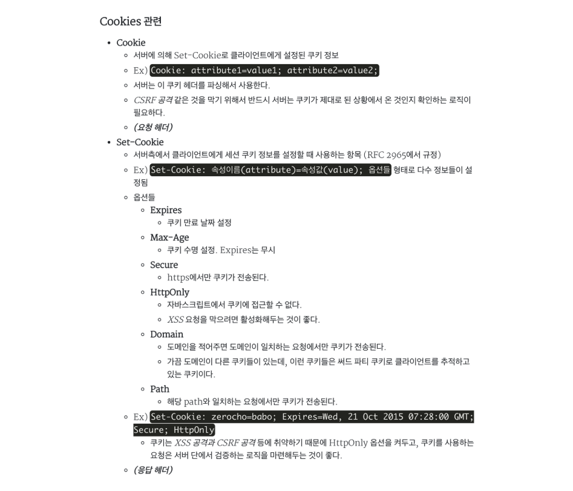
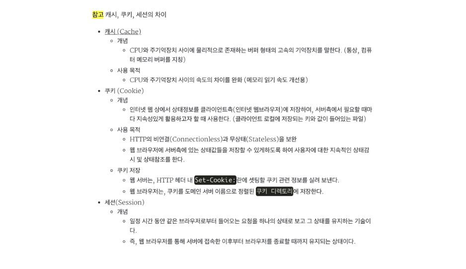

# 실습을 위한 개발 환경 세팅
* https://github.com/slipp/web-application-server 프로젝트를 자신의 계정으로 Fork한다. Github 우측 상단의 Fork 버튼을 클릭하면 자신의 계정으로 Fork된다.
* Fork한 프로젝트를 eclipse 또는 터미널에서 clone 한다.
* Fork한 프로젝트를 eclipse로 import한 후에 Maven 빌드 도구를 활용해 eclipse 프로젝트로 변환한다.(mvn eclipse:clean eclipse:eclipse)
* 빌드가 성공하면 반드시 refresh(fn + f5)를 실행해야 한다.

# 웹 서버 시작 및 테스트
* webserver.WebServer 는 사용자의 요청을 받아 RequestHandler에 작업을 위임하는 클래스이다.
* 사용자 요청에 대한 모든 처리는 RequestHandler 클래스의 run() 메서드가 담당한다.
* WebServer를 실행한 후 브라우저에서 http://localhost:8080으로 접속해 "Hello World" 메시지가 출력되는지 확인한다.

# 각 요구사항별 학습 내용 정리
* 구현 단계에서는 각 요구사항을 구현하는데 집중한다. 
* 구현을 완료한 후 구현 과정에서 새롭게 알게된 내용, 궁금한 내용을 기록한다.
* 각 요구사항을 구현하는 것이 중요한 것이 아니라 구현 과정을 통해 학습한 내용을 인식하는 것이 배움에 중요하다. 

* 

  ### 요구사항 1 - http://localhost:8080/index.html로 접속시 응답

  ### 자바 입출력

  InputStreamReader의 생성자에 필요한 인자는 표준 입력을 통해 획득하고 BufferedReader의 생성자에서 필요한 인자는 InputStreamReader를 사용하면 된다.

  결국 키보드에서 입력한 문자열은 키보드 버퍼에 정보를 저장해 두었다가 사용자가 입력을 마치면 문자열이 JVM에 전달되고 전달된 문자는 다시 System.in인 InputStream 객체로 저장된다.

  다시 이는 InputStreamReader 객체를 생성하는데 사용되고 이어서 BufferedReader 클래스로 부터 객체를 생성하는데 사용되어 진다. BufferedReader 클래스에는 버퍼가 있기 때문에 문자열을 버퍼에 저장해 놓았다가 readLine() 메소드를 통해 한 줄을 한번에 읽어 들이게 되는 것이다.

  ```
  Keyboard buffer -> inputStream -> InputStreamReader -> BufferedReader -> br.readLine()
  ```

  

  ### Java BufferedReader

  소켓프로그래밍을 하거나 파일입출력을 할때 자바가 제공하는 스트림을 사용한다.

  - (InputStream , OutputStream)

  Byte 단위로 처리하기 때문에 영어나 숫자 등은 잘 처리하지만, 단위가 2바이트인 한글은 깨져서 출력된다.

  그래서 char 단위인 InputStreamReader를 쓴다.

  해당 클래스를 쓰면 한글도 잘 출력되지만, 한글자씩 받아와야 하는 상황이 아니면 버퍼에 저장하여 한꺼번에 받는 방식을 많이 사용한다.

  ```java
  InputStream is = // inputStream 초기화는 상황마다 틀리므로, 초기화됬다 가정한다.
  String temp;
  BufferedReader buffer = new BufferReader(new InputStreamReader(is,"UTF-8");
  while((temp = buffer.readLine() ) != null){
  	//........
  }
  ```

  - 주의 할 점

  readLine()은 개행문자가 포함되어야 내부 blocking이 풀리면서 wihle문이 실행한다는 것이다.

  다시 말하자면,

  BufferReader의 readLine() 를 쓸때는 inputStream 이 반드시 개행문자가 포함되어야 한다.

  자바에서의 개행문자는 `"\n"` 이지만,

  스트림에서의 개행문자는 `"\r\n"`이 개행문자이다.

  따라서, 보내는쪽의 데이터 뒤에 `"\r\n"`을 반드시 붙여야한다.

  ## HTTP

  웹 클라이언트(ex. 브라우저)는 웹 서버와 데이터를 주고 받기 위해 HTTP라는 규약을 따른다. 

  **Request Header**

  - 요청 라인(Request line)

    `HTTP-메소드 url HTTP-버전`

    - url : 클라이언트가 서버에 유일하게 식별할 수 있는 요청 자원의 경로

  - 요청 헤더(Request Header)

    `<필드 이름> : <필드 값1>, <필드 값2>`

  - 헤더와 본문 사이의 빈 공백 라인

  - 요청 본문(Request Body)

  **Response Body**

  - 상태 라인(Status line)

    `HTTP-버전 상태코드 응답구문` 

  - 응답 헤더(Reponse Header)

  - 헤더와 본문 사이의 빈 공백 라인

  - 응답 본문(Response Body)

  ---

  ### 요구사항 2 - get 방식으로 회원가입

  * HTTP request line

  ```java
  15:34:01.365 [DEBUG] [Thread-15] [webserver.RequestHandler] - request line : GET /user/create?userId=solar&password=1234&name=%EC%86%94%EB%9D%BC&email=solar%40test.com HTTP/1.1
  ```

  - URL : /user/create?`userId=solar&password=1234&name=%EC%86%94%EB%9D%BC&email=solar%40test.com`
  - path : `/user/create`
  - queryString : `userId=solar&password=1234&name=%EC%86%94%EB%9D%BC&email=solar%40test.com`

  

  #### GET 방식

  - 사용자가 입력한 데이터가 브라우저 URL 입력창에 표시된다.
  - 회원정보(비밀번호)가 URL에 노출되기 때문에 보안에 취약하다.
  - 요청 라인의 길이에 제한이 있다. → GET 방식으로 사용자가 입력할 수 있는 데이터 크기 제한
  - 따라서, 사용자가 입력한 데이터를 서버에 전송해 데이터를 추가할 때 적합하지 않음
  - RESTful API 를 사용하자
    - 요청에 맞는  HTTP Method를 사용하는 방식

  ---

  ### 요구사항 3 - post 방식으로 회원가입

  ### HTTP 메소드

  HTTP는 사용자의 요청 형태에 따라 여러 개의 메소드를 지원

  GET, POST, HEAD, PUT, DELETE, PATCH, TRACE, OPTIONS

  HTML에서 GET, POST 메소드만 사용 가능하도록 지원하고 있다.

  최근의 경향은 REST API 설계와 AJAX 기반으로 웹 애플리케이션을 개발하는 방향으로 발전하고 있는데 이 기반으로 개발할 때는 PUT, DELETE 메소드까지 활용할 것을 추천한다.

  HTML의 모든 <a>태그 링크, CSS, JS, 이미지 요청은 모두 GET방식으로 한다. <form> 태그가 지원하는 method 속성은 GET과 POST 뿐이다.

  나머지 메소드는 서버와의 비동기 통신을 담당하는 AJAX에서 사용할 수 있다.

  - GET
    - 서버에 존재하는 데이터(또는 자원)를 가져온다.
    - 서버에 존재하는 데이터를 조회하는 역할만 담당(데이터 상태를 변경하지 않음)
  - POST
    - 서버에 요청을 보내 데이터 추가, 수정, 삭제와 같은 작업을 실행한다.
    - 데이터의 상태를 변경하는 작업 담당

  GET과 POST만 사용해야 하는 상황이라면 이와 같은 기준으로 구분하고 추구 PUT, DELETE와 같은 다른 메소드를 사용할 때 더 세분화해 사용할 수 있다.

  ---

  ### 요구사항 4 - redirect 방식으로 이동

  #### 회원가입 요청에 대한 응답으로 바로 index.html 페이지 내용을 response 할 때 문제점

  ```java
  if ("/user/create".startsWith(url)) {
        String requestBody = readData(br, Integer.parseInt(headers.get("Content-Length")));
        Map<String, String> params = parseQueryString(requestBody);
        User newUser = createUser(params);
  			url = "index.html"; // 회원가입 처리후 바로 index.html 페이지 response
    }
  ```

  위와 같이 구현 후, 브라우저에서 새로고침을 하면?

  앞서 보냈던 회원가입 요청이 재정송 된다. 브라우저 상에 표시된 화면은 index.html이지만, 새로고침을 하면 이전과 똑같은 회원가입 요청이 발생한다.

  why?

  **브라우저가 이전 요청 정보를 유지하고 있기 때문이다. 새로고침 버튼을 클릭하면 유지하고 있던 요청을 다시 요청하는 방식으로 동작하기 때문**

  이전 요청을 확인하려면 브라우저의 URL을 확인해 보면 알 수 있다.

  회원가입 완료 후 브라우저의 URL은 `/user/create`이지만 화면에 보여지고 있는 내용은 `/index.html` 의 결과 화면을 보고 있다. 이 상태에서 새로고침을 하면 /index.html 화면을 보여주기 전에 회원가입 처리를 한 후, /index.html을 응답으로 전송하게 된다.

  이와 같이 구현할 경우 같은 **데이터가 중복으로 전송되는 이슈가 발생한다.**

  

  #### 해결 방법

  회원가입을 처리하는 /user/create 요청과 첫 화면(/index.html)을 보여주는 요청을 분리한 후 HTTP의 302 상태 코드를 활용해 해결할 수 있다.

  - Response

  ```
  HTTP/1.1 302 Found
  Location: /index.html
  ```

  클라이언트는 위 응답을 받아서 첫 라인의 `상태 코드`를 확인한 후 302라면 `Location` 의 값을 읽어서 서버에 재요청을 보낸다.

  ```java
  if ("/user/create".startsWith(url)) {
  		// ...codes
      User newUser = createUser(params);
      DataOutputStream dos = new DataOutputStream(out);
      response302Header(dos, "/index.html");
  }
  ```

  

  #### Location

  (응답 헤더)

  리소스가 리다이렉트(redirect)된 때에 이동된 주소, 또는 새로 생성된 리소스 주소를 명시한다.

  300번대 응답이나 201 Created 응답일 때 어느 페이지로 이동할지를 알려준다.

  - 새로 생성된 리소스의 경우

    HTTP 상태 코드 201 Created가 반환된다.

  - 300번대 응답의 경우

    HTTP/1.1 302 Found Location: /

    이런 응답이 왔다면 브라우저는 / 주소로 redirect한다.

  > 302면 redirect되어서 body 내용이 필요없는데 Content-Length 헤더가 필요한가?
  >
  > 필요 없다.

  

  #### Path 헤더 (Set-Cookie 옵션)

  해당 path와 일치하는 요청에서만 쿠키가 전송된다.

  

  ---

  ### 요구사항 5 - cookie

  ##### 주의

  - Response 의 Set-Cookie를 매 요청의 응답으로 하면 안 됨.
  - response 에 cookie 사용 가능 범위를 지정해서 보내줘야 함

  ### HTTP 프로토콜

  HTTP는 요청을 보내고 응답을 받으면 클라이언트와 서버 간의 연결을 끊는다.  매 요청마다 연결을 맺고 끊는다면 성능이 많이 떨어질 것이다. 이 같은 단점을 보완하고 성능을 높이기 위해 HTTP 1.1 부터는 한번 맺은 연결을 재사용한다.

  **연결을 재사용하지만 각 요청 간의 상태 데이터를 공유할 수는 없는 무상태 프로토콜의 특성을 가진다.**

  ### Cookie

  HTTP는 클라이언트의 행위를 기억하기 위한 목적으로 쿠키(cookie)를 지원한다.

  서버가 로그인 결과에 따라 `Set-Cookie` 로 결과 값을 저장한다. 클라이언트는 Response Header에 `Set-Cookie` 가 존재하는 경우, 값을 읽어 Cookie값을 저장하고 서버에 보내는 요청 헤더의 `Cookie` 헤더 값으로 다시 전송 한다.

  ------

  ### 쿠키 보안 이슈

  서버가 전달하는 쿠키 정보는 클라이언트에 저장해 관리하기 때문에 보안 이슈가 있다. 이 같은 단점을 보완하기 위해 세션이 등장했다. 세션 또한 쿠키를 기반으로 하는 것은 같다. 좀 더 보안을 강화하기 위한 방법으로 상태 데이터를 서버에 저장한다는 것만 다르다.

  

  ### 쿠키(Cookie) 란?

  - 개념

    - 클라이언트 로컬에 저장되는 키와 값이 들어있는 파일이다.
    - 이름, 값, 유호 시간, 경로 등을 포함하고 있다.
    - 클라이언트의 상태 정보를 브라우저에 저장하여 참조한다.

  - 구성 요소

    - 쿠키의 이름(name)
    - 쿠키의 값(value)
    - 쿠키의 만료시간(Expires)
    - 쿠키를 전송할 도메인 이름(Domain)
    - 쿠키를 전송할 경로(Path)
    - 보안 연결 여부(Secure)
    - HttpOnly 여부(HttpOnly)

  - 동작 방식

    

    1. 웹브라우저가 서버에 요청

    2. 상태를 유지하고 싶은 값을 쿠키(cookie)로 생성

    3. 서버가 응답할 때 HTTP 헤더(Set-Cookie)에 쿠키를 포함해서 전송

       ```
        Set−Cookie: id=doy
       ```

    4. 전달받은 쿠키는 웹브라우저에서 관리하고 있다가, 다음 요청 때 쿠키를 HTTP 헤더에 넣어서 전송

       ```
        cookie: id=doy
       ```

    5. 서버에서는 쿠키 정보를 읽어 이전 상태 정보를 확인한 후 응답

  - 쿠키 사용 예

    - 아이디, 비밀번호 저장
    - 쇼핑몰 장바구니

  ### 세션(Session) 이란?

  - 개념

    - 일정 시간 동안 같은 브라우저로부터 들어오는 요청을 하나의 상태로 보고 그 상태를 유지하는 기술이다.
    - 즉, 웹 브라우저를 통해 서버에 접속한 이후부터 브라우저를 종료할 때까지 유지되는 상태이다.

  - 동작 방식

    

    1. 웹브라우저가 서버에 요청

    2. 서버가 해당 웹브라우저(클라이언트)에 유일한 ID(Session ID)를 부여함

    3. 서버가 응답할 때 HTTP 헤더(Set-Cookie)에 Session ID를 포함해서 전송

       쿠키에 Session ID를 JSESSIONID 라는 이름으로 저장

       ```
        Set−Cookie: JSESSIONID=xslei13f
       ```

    4. 웹브라우저는 이후 웹브라우저를 닫기까지 다음 요청 때 부여된 Session ID가 담겨있는 쿠키를 HTTP 헤더에 넣어서 전송

       ```
        Cookie: JSESSIONID=xslei13f
       ```

    5. 서버는 세션 ID를 확인하고, 해당 세션에 관련된 정보를 확인한 후 응답

  > 세션도 쿠키를 사용하여 값을 주고받으며 클라이언트의 상태 정보를 유지한다.
  > 즉, 상태 정보를 유지하는 수단은 **쿠키** 이다.

  - 세션 사용 예
    - 로그인

  ### 쿠키와 세션의 차이점

  - 저장 위치
    - 쿠키 : 클라이언트
    - 세션 : 서버
  - 보안
    - 쿠키 : 클라이언트에 저장되므로 보안에 취약하다.
    - 세션 : 쿠키를 이용해 Session ID만 저장하고 이 값으로 구분해서 서버에서 처리하므로 비교적 보안성이 좋다.
  - 라이프사이클
    - 쿠키 : 만료시간에 따라 브라우저를 종료해도 계속해서 남아 있을 수 있다.
    - 세션 : 만료시간을 정할 수 있지만 브라우저가 종료되면 만료시간에 상관없이 삭제된다.
  - 속도
    - 쿠키 : 클라이언트에 저장되어서 서버에 요청 시 빠르다.
    - 세션 : 실제 저장된 정보가 서버에 있으므로 서버의 처리가 필요해 쿠키보다 느리다.

  [출처](https://www.notion.so/ssun02/5-6-cookie-596762a9d2e748a39a6bc862c1b976d0#b4bb8f2f37624577a5edac8d99f3d798)

  

  ### HTTP 캐시/쿠키 관련 헤더

  

  

  

  [출처](https://gmlwjd9405.github.io/2019/01/28/http-header-types.html)

  ### CSRF(Cross Site Request Forgery) 공격

  XSS가 사용자가 특정 사이트를 신뢰한다는 점을 공격하는거라면, CSRF는 특정 사이트가 사용자의 브라우저를 신뢰한다는 점을 공격하는 것이 다르다.

  XSS: 클라이언트에서 발생 / CSRF: 서버에서 발생

  ##### **공격 과정**

  ```java
  ..." width="0" height="0">...
  ```

  1. 옥션 관리자 중 한명이 관리 권한을 가지고 회사내에서 작업을 하던 중 메일을 조회한다. (로그인이 이미 되어있다고 가정하면 관리자로서의 유효한 쿠키를 갖고있음)
  2. 해커는 위와 같이 태그가 들어간 코드가 담긴 이메일을 보낸다. 관리자는 이미지 크기가 0이므로 전혀 알지 못한다.
  3. 피해자가 이메일을 열어볼 때, 이미지 파일을 받아오기 위해 URL이 열린다.
  4. 해커가 원하는 대로 관리자의 계정이 id와 pw 모두 admin인 계정으로 변경된다.

  ##### **방어 방법**

  **1. Referrer 검증**

  request header에 있는 요청을 한 페이지의 정보가 담긴 referrer 속성을 검증하여 차단.일반적으로 이 방법만으로도 대부분 방어가 가능할 수 있다.옥션이 아닌 개인 이메일에서 요청이 들어오는 것처럼,같은 도메인 상에서 요청이 들어오지 않는다면 차단하도록 하는 것이다.

  **2. CSRF Token 사용**

  랜덤한 수를 사용자의 세션에 저장하여 사용자의 모든 요청(Request)에 대하여 서버단에서 검증하는 방법.

  ```java
  // 로그인시, 또는 작업화면 요청시 CSRF 토큰을 생성하여 세션에 저장한다. 
  session.setAttribute("CSRF_TOKEN",UUID.randomUUID().toString()); 
  // 요청 페이지에 CSRF 토큰을 셋팅하여 전송한다 
  <input type="hidden" name="_csrf" value="${CSRF_TOKEN}" />
  ```

  **3. CAPTCHA 사용**

  요즘은 거의 모든 웹사이트에서 캡차를 이용하는 것 같은데 캡차이미지상의 숫자/문자가 아니라면 해당 요청을 거부하는 것이다.

  이 외에도 form 태그를 입력할 시 GET방식을 지양하고 POST방식을 쓰도록 하는 것은 기본이라고 할 수 있다.

  [출처](https://www.notion.so/ssun02/5-cookie-596762a9d2e748a39a6bc862c1b976d0#8efac781fd804ecb9c3ffba459481172)

  

  ---

  ### 요구사항 7 - stylesheet 적용

  - 응답 헤더의 Content-Type을 text/html로 보내면 브라우저는 html 파일 로 인식하기 때문에 css가 정상적으로 동작하지 않는다.
  - Stylesheet인 경우 응답 헤더의 Content-Type을 text/css로 전송한다. Content-Type은 확장자를 통해 구분할 수도 있으며, 요청 헤더의 Accept 를 활용할 수도 있다.

  요청과 응답 헤더는 본문 컨텐츠에 대한 정보를 제공한다. 이와 같이 데이터에 대한 정보를 포함하고 있는 헤더 정보들을 `메타데이터` 라고 부른다.

  예를 들어 `Content-Type` , `Content-Length` 헤더 정보는 실제 데이터가 아닌 본문 데이터에 대한 정보를 포함하고 있다.

  ### heroku 서버에 배포 후

  * 